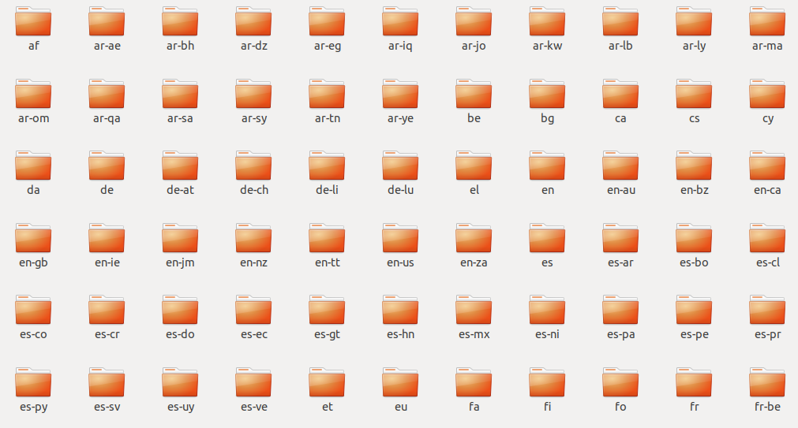
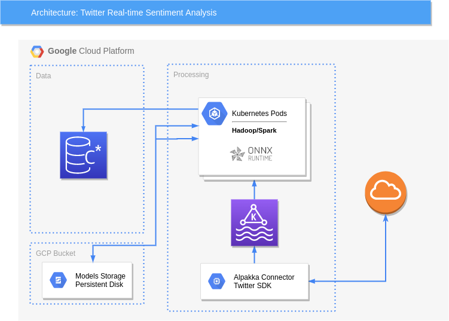

# Relayr Onboarding Test


## Question 1: 
#### Java String Permutations Finder Application:
The purpose of this application is to test finding matching strings from an array regardless of the characters' order. Such matching **strings/words** are also called ***anagrams*** although in this case the more apt word would be ***permutations*** of the string's characters.

#### Technologies Used
  - ##### Java SE
#### Libraries Used
  - ##### JUnit
  - ##### JUnit QuickCheck

#### Implementation
  - The logic of the *permutations search* is implemented in the `com.relayr.onboardingtest.Finder` class.
  - Internally, the class maintains a `HashMap<String,List<Integer>` which maps each *sorted* string of the array to a list of integer indices where that word is found in the array. The `com.relayr.onboardingtest.Finder.find(String)` method uses this internal map to return a list of *anagrams/permutations* found for the given word inside the provided array of words.
 

## Testing Requirements:
    - Java 8 should be installed on the Host Machine for running the tests.
# Steps to Test the Code
### 1. Automatic Testing
 - This uses [JUnit-Quickcheck](https://pholser.github.io/junit-quickcheck/site/0.9.3/) library for property-based testing.
 - The `com.relayr.onboardingtest.tests.AnagramsGenerator` class implements a random Test Case Generator that simply generates a `com.relayr.onboardingtest.tests.Triplet` which is a tuple of:
   1.  The array of *alphanumeric* strings whose anagrams/permutations need to be searched for.
   2.  The **count** of actual anagrams/permutations present for the strings to search for.
   3.  The search array of strings containing a mix of the permuted strings.
 - The `com.relayr.onboardingtest.tests.StringAnagramsSearchTest` class implements ***automatic*** JUnit Tests that test the correctness and performance of `com.relayr.onboardingtest.Finder.find(String)` method.
 - There are ***four*** test methods which use inputs of exponentially increasing size.
 - **If the returned length of the output equals the expected output length then the test passes**.
 ##### Running tests using automatic testing:
- The following shell command can be used to run the automatic testing:
 ```shell 
java -jar <jarFileName> --testAuto
```
### 2. File Based Testing
- This uses [JUnit Parameterized](https://www.baeldung.com/parameterized-tests-junit-5) Tests feature to execute a single test method multiple times with different parameters.
- The `com.relayr.onboardingtest.tests.StringAnagramsSearchTestFile` class implements the ***parameterized*** tests by reading **test cases** from an input file.
- The test uses an input file ***TestCases.txt*** to read the user-supplied test cases.
#### Test Cases File Example:
```
das 1 sad,kls,uav
uva,tus 3 vua,tlk,ust,uav
```
- Each line represents an individual test case.
- The format of each test case is as follows:
    -  Comma-separated list of words to search for in the search array.
    -  An integer representing the expected number of words to be found.
    -  The actual search array containing the words to search from.
 
***Note:*** The **TestCases.txt** file must be present in the ***same*** folder where the **jar** is ran from.
 - **If the returned length of the output equals the expected output length then the test passes**.
 ##### Running tests using File Based testing:
- The following shell command can be used to run the file-based testing:
 ```shell 
java -jar <jarFileName> --testFile
```
## Question 2:
#### Relayr Onboarding Big Data Deep-Dive
The purpose of this question is to create a high-level diagram and description of a big data system that solves the challenge of applying sentiment analysis to a real-time stream of tweets.

#### Twitter Real-time sentiment Analysis
#### Assumptions
The following assumptions have been made to be existing beforehand:
1. The sentiment analysis model is already pre-trained and available.
2. There is a separate model present for every language used in Twitter.
     - It is further assumed that each model is hosted inside a shared volume in a cloud native environment like [GKE](https://cloud.google.com/kubernetes-engine). Each model is available in its own folder which is named according to *ISO 639-1* standard language codes:
     
     - It is also assumed that the model is stored in an open portable format like [PMML](http://dmg.org/pmml/v4-1/GeneralStructure.html), [PFA](http://dmg.org/pfa/docs/tutorial3/), [ONNX](http://onnx.ai), etc. In this case, we assume our sentiment analysis models are based on a Deep Learning Algorithm like transformers (BERT) or sequence models (RNNs, LSTMs), etc.
     - It is assumed that each model encapsulates a complete computation graph in form of a DAG with defined inputs and outputs as well as logic for operators and stored weights/parameters.
     - The model would take string inputs and will handle the pre-processing in a typical NLP pipeline like tokenization, lemmatization, word embeddings/feature vectorization.
     - We will be using [ONNX](http://onnx.ai) as the model format and use [ONNX Runtime](https://github.com/microsoft/onnxruntime) with one of its language specific API's (Java in our case) to run the pre-processing and inferencing.
3. There is direct access to Twitter Firehose and a SDK library which handles *OAuth* authentication and provides a client API to use Twitter Streaming API.
4. Furthermore it is assumed that the SDK library automatically handles unmarshalling of **JSON**-encoded tweets and explicitly defines classes to model different message types in the domain.
5. For the scope of this project, we would be only interested in messages that contain Tweets.

#### Technology Stack
The application is distributed and real-time in nature and the following Big Data frameworks and technologies have been chosen for implementation:
1. **[Twitter4s](https://github.com/DanielaSfregola/twitter4s) SDK**: A twitter client implemented using [Akka Http](https://doc.akka.io/docs/akka-http/current/introduction.html) (a full server- and client-side HTTP stack) and [Json4s](https://github.com/json4s/json4s) (a unified JSON AST library).
2. **[Alpakka Kafka](https://doc.akka.io/docs/alpakka-kafka/current/)** Connector: To serve as a Kafka Producer of raw tweets.
3. **[Apache Kafka](https://kafka.apache.org)**: To serve as a distributed and fault-tolerant real-time message broker service.
4. **[Apache Spark](https://spark.apache.org/docs/latest/structured-streaming-programming-guide.html)** Structured Streaming: To serve as a distributed in-memory tweet pre-processing and sentiment classification module.
5. **[ONNX Runtime](https://github.com/microsoft/onnxruntime)**: Integrated with Spark as a library to provide real-time model serving and inferencing capabilities.
6. **[Apache Cassandra](https://cassandra.apache.org/)**: To serve as a multi-node and scalable backend database for storing the sentiment-classified tweets.


#### High-level System Architecture


#### High-level Implementation Description
##### Twitter Source:
1. Using the *available* Twitter SDK library, a Kafka Producer application will be developed to consume Twitter Firehose and publish raw tweets to Kafka under a pre-defined topic *e.g.* "***raw_tweets***". 
2. The topic will have pre-defined partitions (*e.g. 10-20*) and also a pre-defined replication factor: assuming a *5-node* Kafka cluster the replication factor can be set between *2-3*.
3. Kafka also serves as an intermediate storage to enable fault-recovery in-case the model-serving and inferencing applications experience unexpected failures. The restarted pod applications
should be able to recover and resume consumption of the Kafka consumer stream starting from the last *uncommited* offsets.
4. For load-balancing a partitioning scheme such as ***round-robin*** partitioning or a default scheme like ***consistent-hashing*** can be used.
5. The **key** of each kafka record to be used is the ***"lang"*** attribute of the tweet message so that all tweets with the same language end up in the same partition number.
6. Each tweet record will be serialized using [Avro](https://avro.apache.org) Binary Format to enable storage-efficient serialization and deserialization.
##### Pre-processing, Sentiment Classification and Storage:
1. As already mentioned, each language model for sentiment classification task will be serialized as a self-contained and portable computation graph that includes pre-processing and inferencing.
2. Each model defines a clear interface in order to use it in terms of its inputs and outputs. 
3. Using Spark Structured Streaming, the Spark executors will consume from the kafka topic ***"raw_tweets"*** in parallel.
4. Using a Spark ***udf*** each kafka record will be deserialized into an internal tweet model object.
5. Using [ONNX Runtime](https://github.com/microsoft/onnxruntime) intergated as a library with the Spark application another Spark ***udf*** will be defined in order to:
    1. Take the raw tweet message string column as input.
    2. Select the relevant language model based on the tweet ***key*** which is the language of the tweet.
    3. Infer the sentiment of the tweet message using the selected model.
    4. Return a new column which contains the classified sentiment value for each corresponding tweet.
6. The resulting *dataset* will be stored into a cassandra table with pre-defined partition key (***i.e. date + language***) and clustering
key (***i.e. timestamp***).


 


 * **Author:** Saad Hashmi
 * **Version:** 1.0
 * **Date:** 2020-05-29